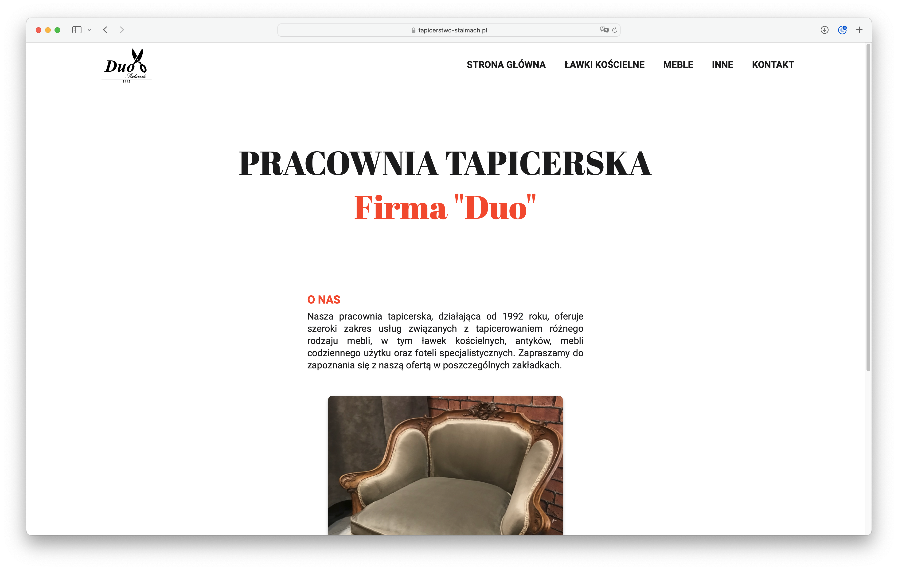
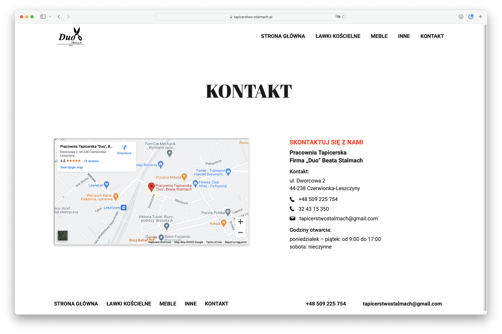

# Duo Upholstery Website
A website I designed, developed, hosted and am currently maintaining for my parents' upholstery business.

- [About](#about)
- [Screenshots](#screenshots)
- [Special thanks](#special-thanks)

## About

> Technologies used:
> - Next.js
> - React
> - TypeScript
> - Sass
> - Fslightbox-react

The project is:
- hosted on 
[tapicerstwo-stalmach.pl](https://tapicerstwo-stalmach.pl/),
- set up for SSG (Static Site Generation) [^1],
- designed for both desktop and mobile,
- optimized for SEO,
- using Fontsource for best performance [^2].

This is a [Next.js](https://nextjs.org/) project bootstrapped with [`create-next-app`](https://github.com/vercel/next.js/tree/canary/packages/create-next-app).

## Screenshots

The website is currently available in Polish only.

## Special thanks
Special thanks to my amazing parents for great support and encouragement.
My skills wouldn't be possible without you ❤️

[^1]: [Next.js: Static Generation](https://nextjs.org/docs/pages/building-your-application/rendering/static-site-generation)

[^2]: [Fontsource](https://fontsource.org/docs/getting-started/introduction)